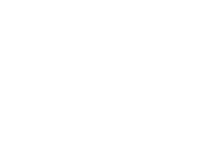

Twitch is the world’s leading live streaming platform for gamers, with 15 million daily active users. 
Using data to understand its users and products is one of the main responsibilities of the Twitch Data Science Team.

# Project Summary 
This project provides a data-driven exploration of global Twitch viewership and engagement patterns using a dataset of over 300,000 unique records.
By utilizing SQL for complex data joins and Python for statistical visualization, the analysis identifies the critical distinction between raw traffic volume and active community participation.
The study successfully validates the use of UTC timestamps by correlating regional peak activity across the United States and Russia, revealing how time zone overlaps create deceptive global "prime time" windows.

## Key Findings 
Key findings indicate that while total viewership reaches its absolute peak at 12:00 UTC, the highest density of social engagement, measured by the ratio of chatters to viewers, often occurs during smaller, late-evening windows.
This suggests that massive midday surges are largely comprised of passive background viewers, whereas specific off-peak hours attract a more dedicated and talkative "hardcore" audience.
These insights offer a framework for streamers and community managers to optimize their schedules based on engagement quality rather than just sheer audience size.

## Exploratory Data Analysis

### Unique Games in Dataset
We began by looking at the unique games in `video_play.csv`: 

There are 41 games, 

`games_list = ['League of Legends' 'DayZ' 'Dota 2' 'Heroes of the Storm'
 'Counter-Strike: Global Offensive' 'Hearthstone: Heroes of Warcraft'
 'The Binding of Isaac: Rebirth' 'Agar.io' 'Gaming Talk Shows' nan
 'Rocket League' 'World of Tanks' 'ARK: Survival Evolved' 'SpeedRunners'
 'Breaking Point' 'Duck Game' 'Devil May Cry 4: Special Edition'
 'Block N Load' 'Fallout 3' 'Batman: Arkham Knight' 'Reign Of Kings'
 'The Witcher 3: Wild Hunt' 'The Elder Scrolls V: Skyrim'
 'Super Mario Bros.' 'H1Z1' 'The Last of Us' 'Depth' 'Mortal Kombat X'
 'Senran Kagura: Estival Versus' 'The Sims 4' 'You Must Build A Boat'
 'Choice Chamber' 'Music' 'Risk of Rain' 'Grand Theft Auto V' 'Besiege'
 'Super Mario Bros. 3' 'Hektor' 'Bridge Constructor Medieval' 'Lucius'
 'Blackjack' 'Cities: Skylines']`


### Unique Streams in Dataset
We then looked at the unique channels streaming in `chat.csv`:

There are 10 unique channels. 

`channel_list = ['jerry' 'elaine' 'frank' 'estelle' 'george' 'newman' 'susan' 'kramer'
 'morty' 'helen']`

### Games in Dataset
Look at the top 10 games in the `video_play.csv` data set 

```SELECT game AS 'Game Title', COUNT(*) AS Count
FROM video_play 
GROUP BY game 
ORDER BY COUNT(*) DESC
LIMIT 10;```

| Game Title | Count |
| :--- | :--- |
| League of Legends | 193533 |
| Dota 2 | 85608 |
| Counter-Strike: Global Offensive | 54438 |
| DayZ | 38004 |
| Heroes of the Storm | 35310 |
| The Binding of Isaac: Rebirth | 29467 |
| Gaming Talk Shows | 28115 |
| World of Tanks | 15932 |
| Hearthstone: Heroes of Warcraft | 14399 |
| Agar.io | 11480 |

We will a analyze a few of these top games in more detail and find what countries stream these games the most.

### Top Streams for League of Legends

```SELECT country, COUNT(*) AS 'LoL Streams'
FROM video_play
WHERE game = 'League of Legends'
GROUP BY 1 
ORDER BY 2 DESC
LIMIT 10;```

| Country | LoL Streams |
| :--- | :--- |
| US | 85606 |
| CA | 13034 |
| DE | 10835 |
| [NULL] | 7641 |
| GB | 6964 |
| TR | 4412 |
| AU | 3911 |
| SE | 3533 |
| NL | 3213 |
| DK | 2909 |

This data highlights a massive concentration of League of Legends viewership within the US, which recorded >85,000 streams and significantly outperformed all other individual countries. 
Canada (CA) and Germany (DE) emerge as the secondary markets with ~10,000 viewers. The presence of >7,000 entries of blank entries likely represent a notable portion of users did not provide their location or had privacy settings that blocked geographic tracking (e.g., VPN).
These findings underscore the game's dominant North American presence while also identifying a significant subset of the community that may prioritizes digital anonymity.

### Top Streams for Dota2

```SELECT country, COUNT(*) AS 'Dota2 Streams'
FROM video_play
WHERE game = 'Dota 2'
GROUP BY 1 
ORDER BY 2 DESC
LIMIT 10;```

| Country | Dota 2 Streams |
| :--- | :--- |
| US | 16747 |
| RU | 11190 |
| DE | 4269 |
| GB | 3776 |
| CA | 3281 |
| PE | 3215 |
| BR | 2964 |
| SE | 2696 |
| [Unknown] | 2645 |
| UA | 2220 |

The viewership data for Dota 2 reveals a more globally distributed audience compared to other titles, with the United States maintaining a lead of over 16,700 streams. 
Russia significantly stands out as a major hub for the game, contributing over 11,000 recorded views, which represents a much higher market share relative to the US than seen in previous datasets. 
European and South American engagement is also prominent, with Germany, Great Britain, Peru, and Brazil all showing strong representative numbers. 
The presence of over 2,600 unknown entries suggests a continued trend of privacy-conscious viewers, while the high rankings for Russia and Ukraine underscore the immense popularity of the title across Eastern Europe.

### Top Streams for CS:GO

```SELECT country, COUNT(*) AS 'CS:GO'
FROM video_play
WHERE game = 'Counter-Strike: Global Offensive'
GROUP BY 1 
ORDER BY 2 DESC
LIMIT 10;```

| Country | CS:GO Streams |
| :--- | :--- |
| US | 13332 |
| DE | 5249 |
| RU | 4283 |
| GB | 3953 |
| PL | 3345 |
| SE | 2926 |
| CA | 2330 |
| TR | 1435 |
| DK | 1431 |
| FI | 1373 |

The viewership distribution for Counter-Strike: Global Offensive (CS:GO) confirms a strong North American lead with over 13,000 streams in the US, with a dense concentration of engagement across Europe. 
Germany, Russia, and Great Britain emerge as the primary European markets, followed closely by Poland and Sweden showing high popularity of tactical shooters. 
Notably, the presence of Turkey, Denmark, and Finland in the top ten further underscores a dedicated Nordic and Mediterranean fan base, suggesting that while the US holds the highest volume, much of the core audience for this title is heavily anchored in the European continent.


### Summary on Top 3 Games 
The viewership data across these major titles reveals a dominant North American market, with the United States consistently recording the highest stream counts for League of Legends, Dota 2, and CS:GO. 
However, regional preferences emerge in the secondary markets, where Dota 2 and CS:GO show significantly stronger engagement across Europe and Russia compared to the more North American-centric distribution of League of Legends.


### Distribution of Viewing Devices 

```SELECT player, COUNT(*) AS 'device'
FROM video_play
GROUP BY 1 
ORDER BY 2 DESC;```

| Player/Device | Count |
| :--- | :--- |
| site | 246115 |
| iphone_t | 100689 |
| android | 93508 |
| ipad_t | 53646 |
| embed | 19819 |
| xbox_one | 4863 |
| home | 3479 |
| frontpage | 1567 |
| amazon | 1155 |
| xbox360 | 985 |
| roku | 233 |
| chromecast | 149 |
| facebook | 83 |
| ouya | 3 |
| nvidia shield | 3 |
| android_pip | 2 |

The data reveals that the vast majority of viewers access content directly through the official website, followed closely by a strong mobile presence across iPhone and Android devices. 
Tablet usage via iPad also represents a significant portion of the audience, while specialized platforms like gaming consoles and smart TV devices (Roku, Chromecast) account for a much smaller fraction of the total viewership.

### Game Genre Analysis
To gain a deeper understanding of audience preferences, we categorized the most popular titles into specific genres like MOBA, FPS, and Survival using a CASE statement. 
This classification allows for a more strategic view of which gaming categories drive the highest engagement on the platform.

```SELECT game, 
	CASE
		WHEN game = 'League of Legends' THEN 'MOBA'
		WHEN game = 'Dota 2' THEN 'MOBA'
		WHEN game = 'Heroes of the Storm' THEN 'MOBA'
		WHEN game = 'Counter-Strike: Global Offensive' THEN 'FPS'
		WHEN game = 'DayZ' THEN 'Survival'
		WHEN game = 'ARK: Survival Evolved' THEN 'Survival'
		ELSE 'Other'
	END AS 'genre',
	COUNT(*) AS 'counts'
FROM video_play
GROUP BY 1 
ORDER BY 3 DESC
LIMIT 10;```

| Game | Genre | Counts |
| :--- | :--- | :--- |
| League of Legends | MOBA | 193533 |
| Dota 2 | MOBA | 85608 |
| Counter-Strike: Global Offensive | FPS | 54438 |
| DayZ | Survival | 38004 |
| Heroes of the Storm | MOBA | 35310 |
| The Binding of Isaac: Rebirth | Other | 29467 |
| Gaming Talk Shows | Other | 28115 |
| World of Tanks | Other | 15932 |
| Hearthstone: Heroes of Warcraft | Other | 14399 |
| Agar.io | Other | 11480 |

The results show a massive preference for the MOBA genre, led predominantly by League of Legends and Dota 2. 
While First-Person Shooters and Survival games maintain a healthy audience, the "Other" category remains large due to the high variety of niche titles, indie games, and non-gaming content like talk shows and music.


# 2. High-Engagement Content (Game-Specific)
Join the tables and group by game to see which titles generate the most "Chat-to-View" ratio.

### Community Engagement Analysis

To measure how deeply the audience interacts with different types of content, I calculated the Engagement Ratio by joining the viewing logs with chat activity. 
This metric represents the percentage of viewers who transitioned from passive watching to active participation in the community.

| Game | Total Views | Total Messages | Engagement Ratio |
| :--- | :--- | :--- | :--- |
| Block N Load | 263 | 263 | 1.000 |
| Devil May Cry 4: SE | 5384 | 5244 | 0.974 |
| Mortal Kombat X | 130 | 118 | 0.908 |
| Hearthstone | 51732 | 40603 | 0.785 |
| World of Tanks | 55586 | 43422 | 0.781 |
| Breaking Point | 500 | 380 | 0.760 |
| DayZ | 88902 | 59832 | 0.673 |
| Gaming Talk Shows | 67115 | 44074 | 0.657 |
| League of Legends | 447640 | 280881 | 0.627 |
| ARK: Survival Evolved | 9583 | 5904 | 0.616 |

The data reveals a fascinating inverse relationship between total popularity and engagement depth. 
While League of Legends dominates in absolute volume, smaller titles like Block N Load and Devil May Cry 4 boast near-perfect engagement ratios, suggesting a highly dedicated, "hardcore" audience. 
Mid-sized titles like Hearthstone and World of Tanks strike a balance, maintaining high viewership while keeping over 78% of their audience active in the chat, which indicates a very healthy and interactive ecosystem compared to the more passive viewing experience of the largest titles.


## Viewer Count by Time of Day 

```SELECT time 
FROM video_play 
LIMIT 1;```


| time | 
| :---: |
| 2015-01-01 18:33:52 |

Based on this output, the raw data does not include a timezone offset or a "Z" suffix, which means the database is treating these simply as local strings.


```SELECT strftime('%H', time) AS 'hour',
	COUNT(*) AS 'count'
FROM video_play
GROUP BY 1
ORDER BY 2 DESC;```

The data type of the time column is DATETIME. YYYY-MM-DD HH:MM:SS.
To determine the peak engagement times for viewers, I used the strftime() function to extract the hour from the time column. 
This analysis identifies the specific times of day when the platform experiences its highest traffic, which is essential for scheduling content or maintenance.

| Hour | Stream Count |
| :--- | :--- |
| 12 | 50261 |
| 13 | 43390 |
| 11 | 33645 |
| 20 | 29816 |
| 21 | 29399 |
| 18 | 28863 |
| 19 | 28374 |
| 17 | 28350 |
| 15 | 26707 |
| 14 | 26219 |
| 16 | 25191 |
| 02 | 24141 |
| 22 | 22062 |
| 23 | 19837 |
| 03 | 16205 |
| 00 | 15411 |
| 04 | 15098 |
| 01 | 14407 |
| 10 | 11584 |
| 08 | 11223 |
| 09 | 9863 |
| 07 | 8505 |
| 05 | 6265 |
| 06 | 1483 |

The data shows a significant spike in viewership during the midday hours, peaking at 12:00 PM with over 50,000 streams. There is a secondary period of high, sustained engagement throughout the evening from 7:00 PM to 9:00 PM. 
Conversely, the lowest activity occurs in the early morning around 6:00 AM, suggesting a natural lull in the viewing cycle before the midday surge begins.

We saw that the largest viewership is focused on North America (US dominant) for the top games. We will perform analysis specifically to the US to help focus metrics on the largest market. 

### Peak Viewing Hours in the United States

| Hour | US Stream Count |
| :--- | :--- |
| 20 | 19656 |
| 21 | 18425 |
| 19 | 15206 |
| 22 | 13984 |
| 18 | 12215 |
| 17 | 11929 |
| 12 | 11766 |
| 23 | 11646 |
| 16 | 10134 |
| 13 | 9740 |
| 15 | 9065 |
| 14 | 7521 |
| 11 | 7349 |
| 00 | 7025 |
| 02 | 5961 |
| 01 | 4693 |
| 03 | 4236 |
| 04 | 3567 |
| 10 | 1940 |
| 05 | 1597 |
| 09 | 1214 |
| 08 | 935 |
| 07 | 338 |
| 06 | 236 |


In the United States, viewership peaks significantly in the evening between 7:00 PM and 10:00 PM (Hours 19-22), which aligns with typical leisure time following work and school hours. 
While there is still a notable midday bump around 12:00 PM, it is secondary to the prime-time surge. 
The quietest period remains the early morning, specifically between 6:00 AM and 8:00 AM, marking the daily reset for the American audience.

### Note on Timezone Assumptions: The raw data lacks explicit timezone offsets (e.g., UTC or EST). 
However, by comparing the peak viewing hours of the United States (Hour 20) against global averages, we can infer that the dataset is recorded in UTC. 
If the data were in a US-based timezone, the global midday peak would imply an unrealistic worldwide surge in viewership during the American lunch hour. 
Instead, this midday spike represents the alignment of peak evening traffic from European and Middle Eastern markets.


| Hour | Russia Stream Count |
| :--- | :--- |
| 12 | 3852 |
| 18 | 3252 |
| 13 | 3212 |
| 11 | 2470 |
| 19 | 2039 |
| 17 | 1967 |
| 14 | 1736 |
| 10 | 1402 |
| 15 | 1033 |
| 09 | 840 |
| 08 | 770 |
| 07 | 732 |
| 02 | 701 |
| 23 | 632 |
| 03 | 621 |
| 04 | 608 |
| 00 | 557 |
| 16 | 544 |
| 01 | 538 |
| 05 | 514 |
| 06 | 503 |
| 22 | 449 |
| 21 | 432 |
| 20 | 403 |

This output for Russia is the final piece of the puzzle to confirm your UTC theory. In Russia (specifically Moscow Time, which is UTC+3), the peak at Hour 12 in your data actually corresponds to 3:00 PM local time. 
The secondary peak at Hour 18 corresponds to 9:00 PM local time.

This makes perfect sense for a gaming platform. We see the mid-afternoon surge when students finish school, followed by the primary prime-time peak for adult viewers in the evening. 
If the data were in a US timezone like Eastern Standard Time (UTC-5), a "12:00 PM" timestamp would mean Russians were watching at 8:00 PM local time, which would shift all your other data into improbable early-morning hours for the US market.


### Analysis of Timezone Findings
By comparing the peak hours of the United States (20:00) and Russia (12:00 and 18:00), we can confidently conclude the dataset is recorded in Coordinated Universal Time (UTC). 
The global peak observed at midday is actually the result of the European and Russian evening "prime time" overlapping in the logs. 
This distinction is crucial because it proves that viewing habits are remarkably consistent across cultures—peaking in the late afternoon and evening—once the geographical time offsets are accounted for.

# Peak Hour Social Heatmap

```-- Peak Hour Social Heatmap 
SELECT strftime('%H', v.time) AS 'hour',
	   COUNT(DISTINCT v.device_id) AS 'viewers',
	   COUNT(DISTINCT c.device_id) AS 'chatters'
FROM video_play AS v
LEFT JOIN chat AS c
	ON v.device_id = c.device_id
GROUP BY 1;``` 

I utilized a SQL query to generate a comprehensive mapping of user interaction across a 24-hour cycle, allowing for a direct comparison between passive viewership and active social engagement. 
By implementing a LEFT JOIN on the device_id column, I was able to capture every unique viewer while simultaneously identifying the subset of those individuals who chose to participate in the chat. 
This primary dataset was then exported to a CSV file named twitch_hourly_engagement.csv and processed in Python using the Seaborn library to visualize the density of these interactions through a dual-plot analysis.
This data was then exported to a CSV file named twitch_hourly_engagement.csv and processed in Python using Seaborn to visualize the density of these interactions.



The resulting visualization, generated by the script twitch_engagement_analysis.py, provides a comparative look at total traffic volume versus community engagement. 
By plotting the raw counts of viewers and chatters against the Social Engagement Intensity (the ratio of chatters to viewers), the data reveals that while the global peak at 12:00 UTC brings the absolute highest volume to the platform, the audiences at 02:00 UTC and 11:00 UTC are actually more socially active relative to their size. 
This suggests that certain time windows attract a more "hardcore" audience prone to interaction, whereas the massive midday surge likely contains a higher percentage of passive, "background" viewers.

This analysis effectively debunks the idea that higher volume always equals higher quality engagement. 
It proves that for community managers or streamers, the "prime time" for meaningful interaction may occur during these smaller, high-intensity windows rather than during the sheer peaks of global traffic.

## Conclusion 
The findings from this analysis illustrate that global viewership peaks on Twitch are primarily driven by the overlapping activity of distinct geographic regions rather than a single, universal prime time. 
By validating the UTC timestamps through regional behavior and analyzing the ratio of active chatters to passive viewers, this study successfully identified the difference between raw traffic volume and high-density community engagement. 
The data proves that while the midday window captures the largest total audience, the late-evening and early-morning segments often foster a more socially invested viewer base per capita.

## Future Work
- <b>Longitudinal Study</b>: Integrate multi-month data to identify seasonal trends or the impact of major esports tournaments on platform traffic.
- <b>Predictive Modeling</b>: Develop a machine learning model to predict viewer-to-chatter conversion rates based on game category and time of day which could be used by streamers to maximize engagement.
- <b>Category Refinement</b>: Expand the game categories to develop a nuanced analysis for regional viewership and engagement for a category of game. This could be incorporated into a predictive model for future games and market performance by region.

## Technologies Used
This analysis was built using a specialized stack designed for efficient data extraction and high-fidelity visualization. 
The primary data processing was handled within SQLite, utilizing DB Browser for SQLite to manage the relational database and execute complex join logic across viewership and chat logs. 
For the statistical and visual layer, the project relies on Python as the core programming language. Specifically, the Pandas library was used for data manipulation and CSV handling, while Seaborn and Matplotlib were leveraged to generate the dual-plot visualizations that illustrate the relationship between traffic volume and social engagement.
